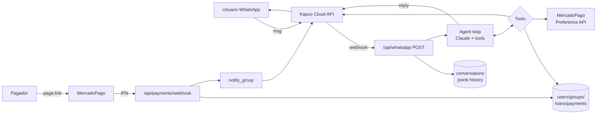

# Lendy — Hackathon MVP

## Context
Repo está vacío (solo `README.md`). Greenfield. Objetivo: MVP demoable en ~2–3 horas de un "Grameen Bank digitalizado": agente WhatsApp que hace onboarding, arma grupos de 5 personas co-responsables, otorga microcréditos, cobra por MercadoPago y usa presión social grupal para repago. Admin dashboard para ver el estado durante la demo.

Éxito = flujo end-to-end funcionando en vivo: "hola" por WhatsApp → onboarding → grupo → préstamo → link MP → pago confirmado → notificación al grupo, y todo visible en `/admin`.

## Shape of the system



Dos entradas al sistema: **webhook de WhatsApp** (loop del agente) y **webhook IPN de MercadoPago** (actualiza pago, notifica al grupo). Todo lo demás cuelga de esas dos.

## Stack
- Runtime: **Bun** (dev); Vercel para deploy
- **SvelteKit** + TypeScript + Tailwind (`bunx sv create`)
- **Drizzle ORM** + `@neondatabase/serverless` (driver `drizzle-orm/neon-http`)
- **Claude**: `@anthropic-ai/sdk`, modelo `claude-sonnet-4-6`
- **MercadoPago**: `mercadopago` SDK oficial
- **WhatsApp/Kapso**: intentar SDK oficial; si el paquete no existe o da problemas, caer a `fetch` directo a la REST API de Kapso (no pelearse con SDKs en hackathon). Definir un único cliente `lib/server/whatsapp.ts` con `sendText(to, body)` y `parseWebhook(req)` para poder swapear.

## Project layout
```
src/
  lib/server/
    db/index.ts              # neon + drizzle client
    db/schema.ts             # tablas + enums + relations
    whatsapp.ts              # sendText / parseWebhook (Kapso)
    mercadopago.ts           # createPreference / parseIPN
    ai/system-prompt.ts      # prompt dinámico por estado
    ai/tools.ts              # tool schemas + handlers (switch por name)
    ai/agent.ts              # loop tool_use hasta stop_reason==end_turn
  routes/
    api/whatsapp/+server.ts            # GET verify + POST webhook
    api/payments/webhook/+server.ts    # IPN MP
    admin/+page.{svelte,server.ts}     # stats
    admin/users/+page.{svelte,server.ts}
    admin/groups/+page.{svelte,server.ts}
    admin/loans/+page.{svelte,server.ts}
    +page.svelte             # redirect → /admin
drizzle.config.ts
.env
```

## Schema (drizzle)
Campos monetarios en **centavos ARS** (integer). Enums via `pgEnum`.

- **users**: `id`, `phone` (unique), `name?`, `dni?`, `monthly_income?`, `occupation?`, `onboarding_complete` (default false), `group_id? → groups`, `created_at`
- **groups**: `id`, `name`, `invite_code` (unique, 6 chars), `max_members` (5), `status` enum `forming|active|defaulted`, `created_at`
- **loans**: `id`, `user_id`, `group_id`, `amount`, `total_installments`, `installments_paid` (0), `installment_amount`, `status` enum `active|paid|overdue`, `next_due_date?`, `created_at`
- **payments**: `id`, `loan_id`, `amount`, `mp_preference_id?`, `mp_payment_id?`, `status` enum `pending|approved|rejected`, `payment_link?`, `created_at`
- **conversations**: `id`, `user_id` (unique), `messages` jsonb (array en formato Anthropic: `{role, content}` donde `content` puede ser array con `text`/`tool_use`/`tool_result` blocks — guardar tal cual), `state` enum `onboarding|group_formation|active|payment_pending`, `updated_at`

Inicialización: `bunx drizzle-kit push` (skip migrations formales).

## Webhook de WhatsApp
`routes/api/whatsapp/+server.ts`:
- `GET`: verify token handshake (retorna `hub.challenge`).
- `POST`: parse payload → extraer `{from, text}` → `upsert user by phone` → cargar/crear `conversation` → push `{role:"user", content:text}` → `agent.process(user, conversation)` → `sendText(from, reply)` → persistir `conversation.messages` → `return 200` (responder rápido, pero sincrónico está OK para demo; si Kapso exige <5s y el loop se pasa, usar `event.platform.context.waitUntil` o similar de Vercel).

## Agent loop (`ai/agent.ts`)
Pseudocódigo:
```
while true:
  res = anthropic.messages.create({
    model: "claude-sonnet-4-6",
    system: buildSystemPrompt(user, group, loan),
    tools: TOOLS,
    messages: conversation.messages,
    max_tokens: 1024,
  })
  conversation.messages.push({ role:"assistant", content: res.content })
  if res.stop_reason == "tool_use":
    toolResults = []
    for block in res.content where type=="tool_use":
      out = await handleTool(block.name, block.input, { user, ... })
      toolResults.push({ type:"tool_result", tool_use_id: block.id, content: JSON.stringify(out) })
    conversation.messages.push({ role:"user", content: toolResults })
    continue
  else:
    return textOf(res.content)  // stop_reason=="end_turn"
```
Guard-rail: máx 5 iteraciones por turno para no colgar el webhook.

Usar **prompt caching** en `system` (cache_control ephemeral) — el prompt es largo y se repite por mensaje.

## Tools (7)
Definir schemas en `ai/tools.ts` y handlers en el mismo archivo (switch por nombre). Cada handler recibe `(input, ctx)` donde ctx tiene `user`, `db`.

1. `save_user_profile({name, dni, monthly_income, occupation})` — update user, `onboarding_complete=true`
2. `create_group({group_name})` — insert group con `invite_code` random (6 chars, `nanoid` o `crypto.randomUUID().slice(0,6)`), set `user.group_id`
3. `join_group({invite_code})` — buscar grupo, agregar user, si count==5 → `status=active`
4. `get_group_status({})` — lista miembros, sus préstamos activos, cuotas pendientes, mora
5. `create_loan({amount})` — sólo si grupo `active` y user sin préstamo activo; calcular `installment_amount = round(amount*1.05/4)`, `total_installments=4`, `next_due_date=now+7d`
6. `generate_payment_link({loan_id})` — crear MP Preference por `installment_amount`, `back_urls` a `BASE_URL`, `notification_url = BASE_URL/api/payments/webhook`, insertar `payments` con `mp_preference_id` y `payment_link=init_point`
7. `notify_group({message})` — fetch miembros del grupo del user actual, `sendText` a cada uno (excluir al caller). Usar para anuncios de mora y confirmaciones de pago.

## MercadoPago IPN (`routes/api/payments/webhook/+server.ts`)
- Recibe `?topic=payment&id=...` (query) o body JSON según modalidad.
- `mercadopago.payment.get(id)` → si `status=='approved'`:
  - update `payments.status='approved'` + `mp_payment_id`
  - `loan.installments_paid++`; si `==total_installments` → `status='paid'`, else `next_due_date += 7d`
  - `sendText` al pagador + `notify_group` ("Fulano pagó su cuota. Quedan X pendientes.")
- Return 200 siempre (evita reintentos agresivos).

Sandbox credentials + comprar con usuario de test.

## Admin (`/admin/*`)
Server-rendered, sin auth. `+page.server.ts` hace queries directas con drizzle y devuelve data al `+page.svelte`. Tailwind para tablas. Tres páginas:
- **Overview**: cards — users, groups (forming/active), loans (active/overdue/paid), monto prestado total, monto cobrado.
- **Users**: phone, name, onboarding, group, préstamo activo.
- **Groups**: name, invite_code, estado, miembros (count/5), total prestado al grupo. Fila roja si algún loan en `overdue`.
- **Loans**: filtro por status, columnas user/group/amount/cuotas/next_due. (Sin botón de acciones — simplifica.)

Componentes mínimos: `StatusBadge.svelte` (coloreo por enum), `DataTable.svelte` (tabla genérica con headers + rows slot).

## Env vars
```
DATABASE_URL=postgresql://...neon.tech/neondb?sslmode=require
KAPSO_API_KEY=...
KAPSO_PHONE_NUMBER_ID=...
KAPSO_VERIFY_TOKEN=...           # para GET handshake
ANTHROPIC_API_KEY=sk-ant-...
MP_ACCESS_TOKEN=APP_USR-...
BASE_URL=https://xxxx.ngrok.app  # para webhooks en dev
```

## Implementation order (phases)

| # | Fase | Entregable verificable |
|---|------|------------------------|
| 0 | Scaffold: SvelteKit+TS+Tailwind, deps, `.env`, drizzle `push` | `bun dev` arranca, tablas en Neon |
| 1 | Webhook WhatsApp echo (sin agente) + ngrok → config Kapso | Mandar "hola" por WA, recibir "hola" |
| 2 | Agent loop + tools 1–3 (profile, create_group, join_group) | Onboarding completo por chat; user y group en DB |
| 3 | Tools 5–6 (loan, payment_link) + MP IPN | Pido préstamo → recibo link → pago sandbox → DB actualizada |
| 4 | Tools 4, 7 (group_status, notify_group) + lógica overdue | Mora detectada → al abrir chat, agente menciona; pago confirmado → mensaje al grupo |
| 5 | `/admin` (overview + 3 tablas) | Ver todo el estado en vivo |
| 6 | Polish + demo script + seed si hace falta | Happy path cronometrado < 5 min |

## Simplificaciones asumidas (no implementar)
- Sin auth en `/admin`
- Sin credit scoring: aprobar cualquier monto dentro de rango hardcoded (ej. ARS 5k–50k)
- Sin matching de grupos: solo crear/unirse por código
- Interés flat 5% (no TEA/CFT real)
- Un préstamo activo por usuario
- Sin rate limiting / retries elaborados / Sentry
- Sin migrations formales (drizzle `push`)
- Idempotencia IPN best-effort (check `payments.mp_payment_id` antes de marcar approved)

## Verification (end-to-end demo)
1. `GET /admin` → vacío
2. WhatsApp → "Hola" al número Kapso → agente saluda, pide datos
3. Completar onboarding → user aparece en `/admin/users` con `onboarding_complete`
4. "Quiero crear un grupo llamado Los Tigres" → recibo `invite_code`
5. Desde otro número (o 4 mocks por SQL), unirse con el código hasta 5 → group `active`
6. "Necesito 20000 pesos" → agente crea loan, llama `generate_payment_link`, envía URL MP
7. Pagar con tarjeta de test → IPN llega → `/admin/loans` muestra `installments_paid=1` → todos los miembros del grupo reciben WA con la confirmación
8. Forzar `next_due_date` a ayer en SQL → mandar otro mensaje del usuario → agente menciona mora; `/admin/groups` fila en rojo

## Critical files to create
- `src/lib/server/db/schema.ts` — fuente de verdad del modelo
- `src/lib/server/ai/agent.ts` — loop tool_use con guard-rail de 5 iteraciones
- `src/lib/server/ai/tools.ts` — 7 handlers
- `src/routes/api/whatsapp/+server.ts` — entry point del agente
- `src/routes/api/payments/webhook/+server.ts` — cierre del ciclo de pago
- `src/lib/server/whatsapp.ts` — aislante del SDK de Kapso (swapeable a `fetch`)